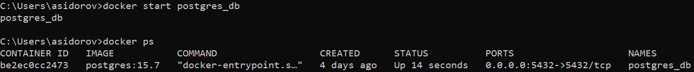

# OTUS_HW_DB_COMMON
Репозиторий для домашних заданий ОТУС Базы Данных. Общие сведения.

### Диграмма для базы данных застройщиков, их объектов и покупателей.

В качестве основной СУБД выбрана postgres 15

### Бизнес цель: Создание сайта агрегатора для покупки и продажи квартир
> Для справки про табличку **"buyer"**. Так как строение БД довольно простое, именно для обучения, была добавлена табличка **"buyer"** имеющая связь *ManyToMany*.
* **"housing_complex"** - информация о застройщике
* **"house"** - информация о здании
* **"hb_object"** - информация об объекте продажи(квартира)
* **"object_space"** - информация об участвках объекта(комната, коридор, ванная комната...)
* **"buyer"** - информация о покупателе
* **"buyer_hb_object_link"** - линковочная таблица для связки покупатель-объект
* **_type** и **_status** - таблицы типов и статусов. Для каждого объекта свои типы и статусы для соблюдения консистентности данных.

# Задание 3
> - Развернуть контейнер с PostgreSQL или установить СУБД на виртуальную машину.
> - Запустить сервер.
> - Создать клиента с подключением к базе данных postgres через командную строку.
> - Подключиться к серверу используя pgAdmin или другое аналогичное приложение.

### Работу будем производить через Docker
Скачал образ postgres 15.7
\
Запустил контейнер на порту 5432 с пробросом порта 5432
\
Подключился к контейнеру\
\
Подключился к СУБД через пользователя postgres\
\
Создал новую Базу Данных **test_db**\
\
Подключился к новой базе данных **test_db**\
\
Создал нового пользователя **dev**\
\
Добавил права пользователя **dev**\
\
Подключились через cli в контейнере через нового пользователя **dev** к базе данных **test_db**\
\
Настроили подключение из вне через Dbeaver как пользователь **dev** к базе данных **test_db**\
\
Произвели тест соединения\
\
Результат подключения к базе данных **test_db**\

